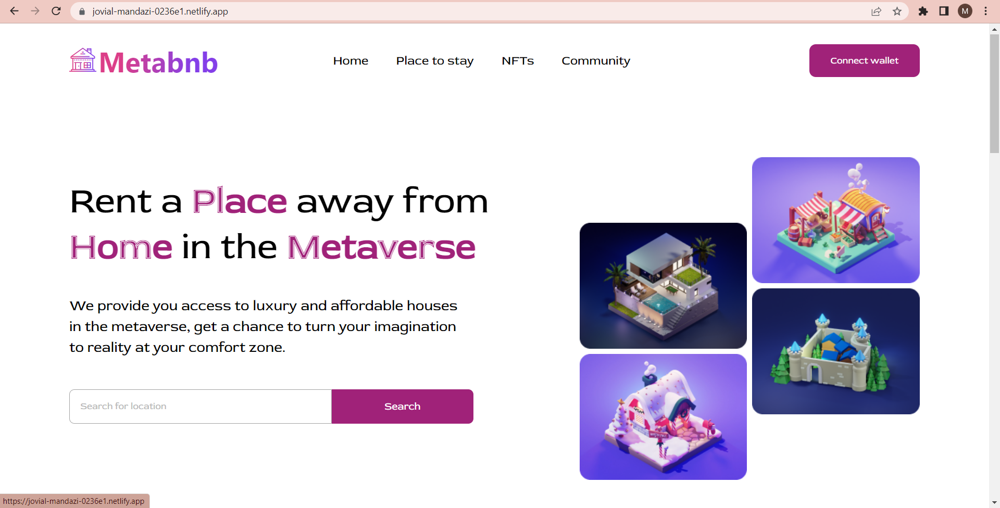
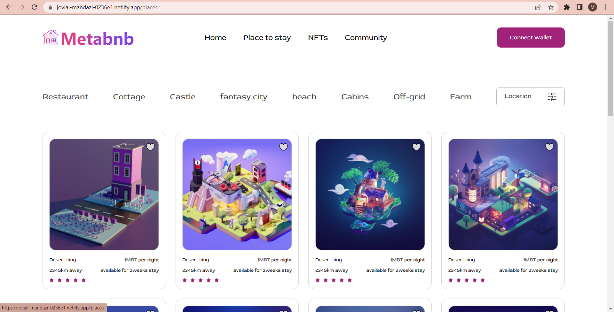
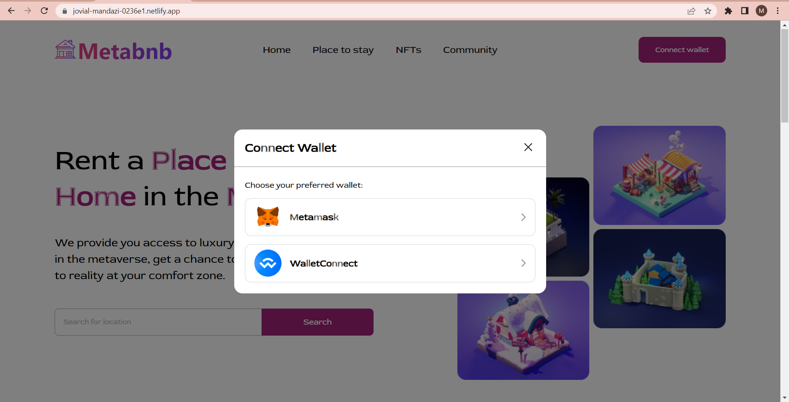

# Metabnb

## Table of contents

- [Overview](#overview)
  - [The challenge](#the-challenge)
  - [Screenshot](#screenshot)
- [My process](#my-process)
  - [Built with](#built-with)
  - [What I learned](#what-i-learned)
  - [Continued development](#continued-development)
- [Author](#author)

## Overview

### The challenge

Users should be able to:

- View the optimal layout for the site depending on their device's screen size
- See hover states for all interactive elements on the page

### Screenshot

## My process

### Built with

- CSS custom properties
- CSS Flex
- Mobile-first workflow
- React JS

### What I learned

I learnt how to properly make use of figma in design implementation

### Continued development

- Mobile view
- Navigation

## Author

- Akosa Praise

